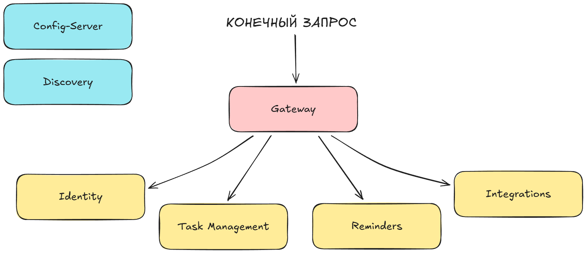

# 🏠 Chore Manager

Это приложение для **совместного ведения бытовых дел**, разработанное в рамках дипломной работы

Главная особенность проекта — **автоматическое распределение обязанностей**: задачи создаются один раз, а ответственные за их выполнение назначаются автоматически по заданным правилам

Помимо веб-приложения, в системе также реализованы **интеграции с Telegram и Яндекс Алисой**: через Telegram можно получать напоминания о задачах, а через Алису — узнавать информацию о своих делах голосом

**Сайт проекта:** [https://chore-manager.ru](https://chore-manager.ru)

**Автор: Влад Михайлов**

## 🛠️ Стек технологий

**Backend:** Java, Spring Boot, PostgreSQL, Kafka, Swagger

**Frontend:** TypeScript, React, Tailwind CSS

**Инфраструктура:** Docker

**Тестирование:** JUnit, MockMvc, Testcontainers

## 📌 Схема микросервисов

## 🔧 Описание микросервисов

| Название микросервиса | Описание                                                                                                                                                                                                                                                    |
|-----------------------|-------------------------------------------------------------------------------------------------------------------------------------------------------------------------------------------------------------------------------------------------------------|
| `config-server`       | конфиг-сервер, который управляет настройками всех микросервисов                                                                                                                                                                                             |
| `discovery`           | сервер **Eureka**, где регистрируются остальные микросервисы                                                                                                                                                                                                |
| `gateway`             | единая точка входа, сюда отправляются все запросы от пользователей или микросервисов. Здесь проверяется **JWT-токен** (для внешних запросов) или **серверный токен** (для внутренних запросов), и если всё верно — запрос пересылается в нужный микросервис |
| `identity`            | для работы с учётной записью пользователя                                                                                                                                                                                                                   |
| `task-management`     | для работы с доменной логикой приложения: списки дел, задачи и т.д.                                                                                                                                                                                         |
| `reminders`           | для формирования напоминаний по расписанию                                                                                                                                                                                                                  |
| `integrations`        | для взаимодействия с внешними платформами (Телеграм и Яндекс Алиса)                                                                                                                                                                                         |

## 🧪 Тестирование

В проекте реализованы следующие типы тестов:

- **Юнит-тесты** — тестируют только один компонент, остальные мокаются
- **Интеграционные тесты** — запускают микросервис с реальной БД (поднимается в тестовом окружении), но с моками других микросервисов
- **End-to-end тесты** — тестируют взаимодействие полностью поднятых микросервисов

Чтобы запустить **юнит-тесты** и **интеграционные тесты**, нужно перейти в папку нужного микросервиса и выполнить команду `./mvnw clean test`

**End-to-end тесты** вынесены в отдельный модуль `e2e-tests`. Чтобы их запустить, нужно предварительно поднять всё окружение, затем перейти в папку `e2e-tests` и выполнить команду `./mvnw clean test`

## 🚀 Запуск и использование

### Локальный запуск

Перед запуском в корне проекта нужно создать файл `.env` (можно скопировать из `.env.example` и заполнить нужные значения)

Для локального запуска достаточно выполнить команду: `docker compose up -d --build`. После этого автоматически поднимется инфраструктура, микросервисы и фронтенд

### После запуска

🔹 После поднятия всех приложений желательно **подождать ~60 секунд**, чтобы **Eureka** успела прогрузить все микросервисы

🔹 **Итоговое веб-приложение** доступно по адресу: [`http://localhost/`](http://localhost/)

🔹 Все конечные эндпоинты и DTO задокументированы в **Swagger**: [`http://localhost:8080/swagger-ui.html`](http://localhost:8080/swagger-ui.html)

🔹 Просмотреть зарегистрированные микросервисы можно через **Eureka**: [`http://localhost:8761/`](http://localhost:8761/)

### Несколько скриншотов UI

[//]: # (.............. Скрины ..............)